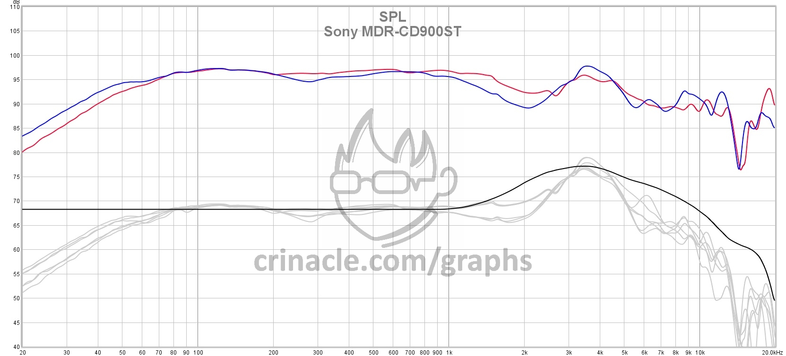
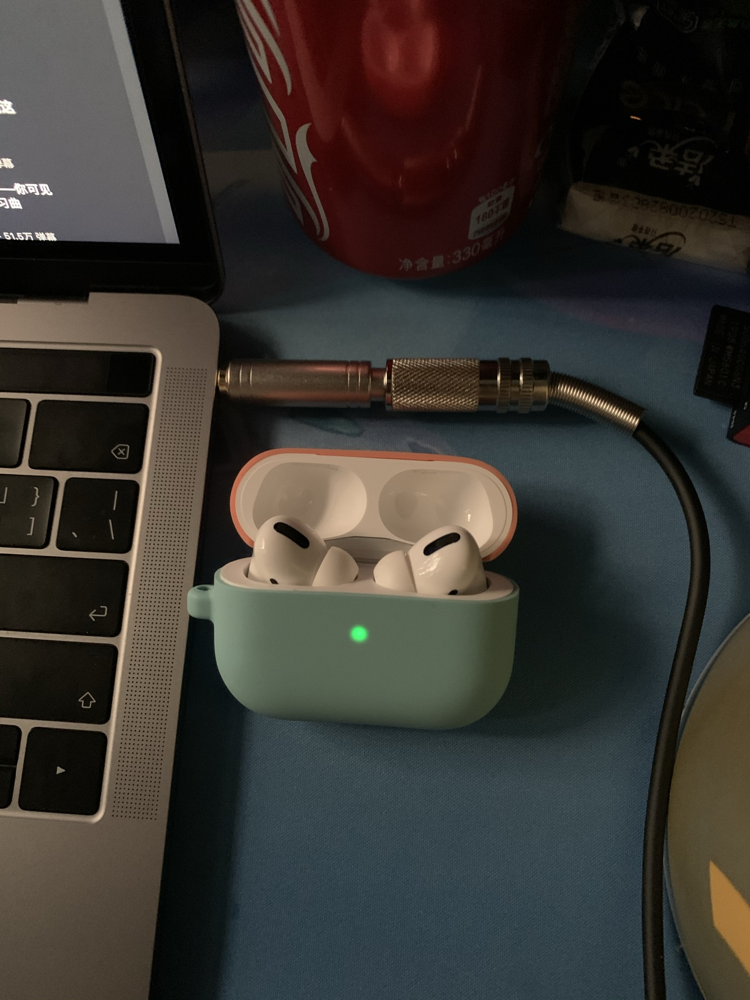

# Sony MDR-CD900st

## 参数

| 格式：   | 头戴式/密封式         |
| ------- | -------------------------------- |
| 频带：   | 5Hz-30,000Hz                        |
| 阻抗：   | 63Ω                                   |
| 灵敏度：   | 106dB/mW                           |
| 插头：   | 2.5m，6.3mm立体声标准插头（直式，不可拆卸） |
| 备注：   | 发布于1989年，仅在日本发售，Made in Japan。   |

\*上图黑色曲线为目标曲线。中文及英文网络上没有找到 CD-900st 的 CSD。

## 价格

* 官网：18,000円＋税（约合人民币￥1200）。
* 亚马逊海淘价格￥1500。
* 某宝上只有两家店，一家是留日代购，一家是某数码店，真假未知。￥1100 。

## 售后

* 产品说明明确表示专业级产品，没有售后（滑稽）。可以买到每个部分的原装备件，你甚至可以自己组装一个耳机出来。同时因为中国很多电视台都在用 MDR-7506，所以生产备件的华强北厂商很多（7506 和 900st 耳罩通用）。

## 结论

* 这只耳机适合听的歌曲：

| Genre       | 适合听 | 不适合听         |
| ----------- | ------ | ---------------- |
| Pop         | √      | 贝斯很多的 J-Pop |
| Electronic  | √      |                  |
| Dance/EDM   | √      |                  |
| Classical   | √      |                  |
| Rock        | √      |                  |
| Jazz/Blues  | √      |                  |
| R&B/Soul    | √      |                  |
| Hip-Hop/Rap | √      |                  |
| Acoustic    | √      |                  |

注：对曲风的分类参考 Apple Music。

又注：不适合听参与响度战争的任何歌曲。音乐制作的缺陷在此耳机上会无限放大。

### 缺点

* 先说最明显的缺点。这只耳机从 100Hz-1KHz 的频响曲线几乎是平的，因此还原度很高。而在 1k 之后升起延后了。因此在 1k-2k 这段低于哈曼曲线。由于弗莱彻-门森等响效应，当音量调低，在中低频（贝斯）持续时间很长、量很多的曲风上，声音不讨喜，会有“糊在一起”的感觉。例如，J-Pop、J-Rock歌曲。
* 没有“声场”。人声、低音、乐器都贴着耳朵，听起来好像这只耳机把所有音乐细节都打包在一起怼给你。这种效果与部分价格很高的耳机不同。但是个人体验，这只耳机的声音初听并不适应，听久了会觉得这才是最纯粹朴素的音乐，听起来也不会有很大负担。至于这是真实好声音还是脑放开启，就无从得知了。（耳机并不存在物理上的“声场”这种概念。因为营造声场不仅需要频域变换，还需要时域变换。简而言之，不需要充电的耳机都不具有模拟声场的能力。传统高端耳机厂商通过对频率响应进行设计，以模拟人耳平时听音乐感受到的效果：例如，森海塞尔经常增强超低频、略微削弱特定高频，以模拟声音在空气中传播的高频衰减，营造空间感和氛围感，这也是其“古典味”的来源。但是真的要追求声场，最好的方法是买一对监听音箱并且摆在正确的位置。如果条件不允许，那就用 HomePod 吧。）
* 这只耳机用的是专业设备常用的 6.3mm 接头，若要在一般的音频设备上使用，需要额外 6.3mm 转 3.5mm 转换接头。虽然隔音不错，但不适合出街，除非你能忍受比 AirPods Pro 充电盒还长的接头，和 2.5m 的耳机线。

* 耳罩比较薄也略小、头梁比较短（可能是为日本用户优化的结果），如果你的耳朵比较大/头比较大，长时间佩戴会压耳廓、夹头。如果你碰巧和我一样头小耳朵小，那么佩戴感觉应该是很舒适的。不夹头的同时重量轻。

* 如果看到这里你没有关闭这个页面，说明你大概率是这个耳机的目标用户。

### 优点

* 颜值高（耳罩上的红标很骚），做工扎实，没有断梁问题（SRH840 有）。全封闭式设计，隔音非常不错，在正常听歌音量基本没有音频泄露，图书馆也可以用。比起 7506 的电话线，采用了直线而比较方便携带。

* 人声是这只耳机的绝对强项。并非追求“女毒”通透感而放弃真实，而是由人声的极致还原展现充沛的情感。并且因为该耳机被几乎所有日本录音室采用，MDR-CD900st非常适合追番。可以最大程度展现出声优声线的特点（当然，也能听到使用普通耳机注意不到的口胡）。简而言之就是，声优声音的细节能“一闻无余”，有种 ASMR 的感觉。能真切地被歌手的唱功感动到。（蔡琴、布施明（误）、安德烈波切利）
* 极低频比较少，低频量刚好，这点从频响曲线也能看出来。不轰头，长时间听歌舒适，不费耳朵。低频恢复速度很快，没有多余谐波。直观的描述就是鼓点弹性很好，拳拳到肉，很动感。因此听大部分电子舞曲的感受都非常不错。（打音游魔王曲也特别爽（。
* 对弦乐器表现很好。音域过渡平滑，音色饱满，声音不过尖。（RV269“四季-春”、BMV1007“G大调第一大提琴组曲”）交响乐试听中，三频表现均衡，该有的都有。没有喧宾夺主也没有缺斤短两。（卡拉扬）
* 优秀的音频回放设备让你觉得这声音“本该如此”，非常真实自然。而不是“哇，这人声真通透”，因为人类声带无法发出那么通透的声音。MDR-CD900st就是一只这样的耳机。
